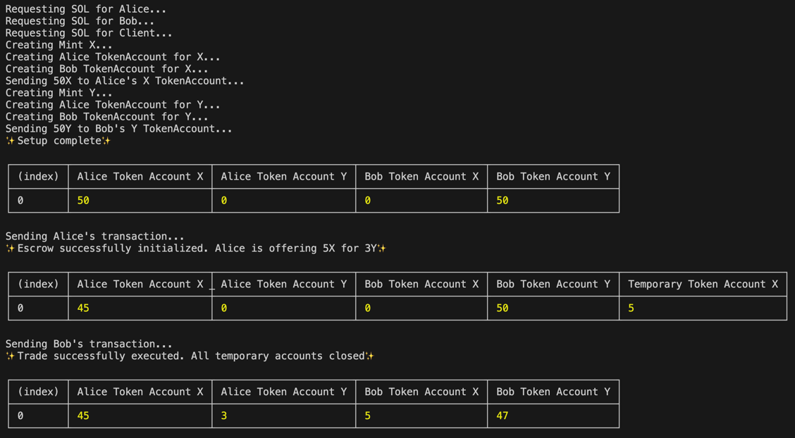

# Solana Escrow Program

### How to run

# escrow-scripts

scripts that can be used to interact with an [escrow-program](https://github.com/paul-schaaf/solana-escrow)


## Commands

All available commands can be found in the `package.json` file. Start by going into your escrow program repo and building your program with
```
cargo build-bpf
```
This command will output the location of your executable (ending with `.so`). Copy it and execute the following script from this repo to start up the validator you'll need for the other scripts.
```
npm run setup-validator <EXECUTABLE_LOCATION>
```

If you need to call `solana-test-validator` from a specific folder, go into that folder and execute the following command instead. Note that the `r` flag will reset the validator if there was a validator started in that folder before.
```
./solana-test-validator -r --mint E2F3fsS1HpsLb2VpEgsA5ztfo83CWFWW4jWpC6FvJ6qR --bpf-program 4yBTZXsuz7c1X3PJF4PPCJr8G6HnNAgRvzAWVoFZMncH <EXECUTABLE_LOCATION>
```

Now, in another tab, you can start executing the scripts to interact with your escrow program. There are three scripts: `setup`, `alice`, and `bob`. `setup` initializes SOL accounts as well as the necessary token accounts for Alice and Bob. `alice` executes Alice's transaction and `bob` executes Bob's transaction. Start by installing the necessary dependencies.
```
npm install
```

You can then run the following command to setup and run the two transactions.
```
npm run all
```
But you don't have to execute all three at once. For example, you can run
```
npm run setup-alice
```
to run everything up to bob's transaction. See the `package.json` file for more.

### Results
